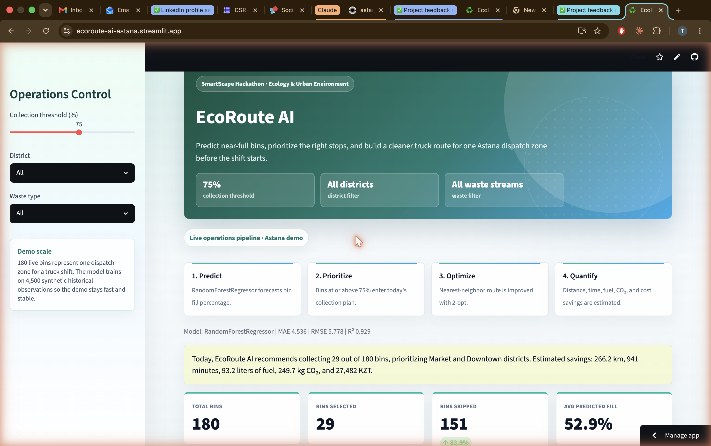

# ♻️ EcoRoute AI

**Predictive waste collection & route optimization for smart cities.**

EcoRoute AI predicts how full each waste bin is, picks only the bins that actually need emptying, and builds a shorter truck route — cutting fuel, driver time, cost, and CO₂. Built for Astana as a demo city.

🔗 **Live demo:** https://ecoroute-ai-astana.streamlit.app  ·  🏙️ **Built for:** Astana Innovations Accelerator — Ecology & Urban Environment



> Add a screenshot at `assets/screenshots/dashboard.png` so the dashboard shows here without anyone needing to run the app. See "Add a screenshot" below.

---

## The problem

Cities run waste trucks on **fixed routes** — the same loop every day, emptying bins that are only half full while busy areas overflow. That wastes fuel, time, and municipal budget, and adds avoidable emissions.

## The solution

EcoRoute AI replaces the fixed schedule with a demand-driven one, in four steps:

1. **Predict** bin fill levels with a machine-learning model.
2. **Prioritise** — only bins above a chosen threshold join today's plan.
3. **Optimise** the route with nearest-neighbour + 2-opt.
4. **Quantify** the distance, time, fuel, CO₂, and cost saved.

A dispatcher sees the full plan on one map before the shift, tunes how aggressive collection is, and exports the exact route order.

## Results (latest demo run)

| Metric | Value |
|---|---|
| Model | RandomForestRegressor |
| MAE / RMSE / R² (synthetic test set) | 4.53 / 5.78 / 0.929 |
| Demo zone | 180 bins, one Astana truck shift |
| Bins selected at 75% threshold | 29 of 180 |
| Optimised route | 38.4 km |

Scenario comparison (vs. visiting all bins on a fixed route):

| Scenario | Threshold | Bins selected | Distance saved |
|---|---|---|---|
| Conservative | 85% | 12 | 283.8 km |
| Balanced | 75% | 29 | 266.2 km |
| Aggressive | 65% | 52 | 246.6 km |

> Metrics are measured on a **synthetic** dataset (see Data). They demonstrate the pipeline works end-to-end; real-world accuracy will be validated on live sensor data during a pilot.

## Key features

- ML bin fill-level prediction with feature-importance view
- Configurable collection threshold + conservative/balanced/aggressive scenarios
- Nearest-neighbour routing improved by 2-opt
- Interactive Plotly map with priority-coloured bins and the optimised route
- City-manager recommendation and critical-bin district alerts
- Savings dashboard: distance, time, fuel, CO₂, cost (KZT)
- Downloadable selected-bin and route-order CSVs

## Data

Real municipal smart-bin data isn't public, so the prototype uses a **realistic synthetic dataset** built from practical collection factors (district activity, waste type, capacity, weather, time since pickup). **The pipeline is designed so a real IoT sensor feed can replace it without code changes** — that's the first step of a city pilot.

## Tech stack

Python · Streamlit · scikit-learn · pandas · numpy · Plotly · joblib

## Run locally

```bash
python -m venv venv
# macOS/Linux:
source venv/bin/activate
# Windows:
venv\Scripts\activate

pip install -r requirements.txt
streamlit run app.py
```

The app auto-generates the demo data and trains the model on first run.

## Add a screenshot

1. Run the app locally (`streamlit run app.py`).
2. Take a screenshot of the dashboard.
3. Save it as `assets/screenshots/dashboard.png` and commit it.

The image at the top of this README will then display automatically.

## Project structure

```
ecoroute-ai/
├── app.py               # Streamlit dashboard
├── src/                 # data generation, model, prediction, routing, savings, maps
├── data/                # generated demo data (csv)
├── models/              # trained model + metrics
├── tests/               # core-logic tests
└── assets/screenshots/  # dashboard image(s)
```

## Roadmap

- Real IoT smart-bin sensor integration
- Live traffic-aware routing
- Multi-truck fleet optimisation
- Dynamic scheduling + citizen reporting
- City-manager analytics dashboard

---

*Built for the Astana Innovations Accelerator. Demo city: Astana, Kazakhstan.*
